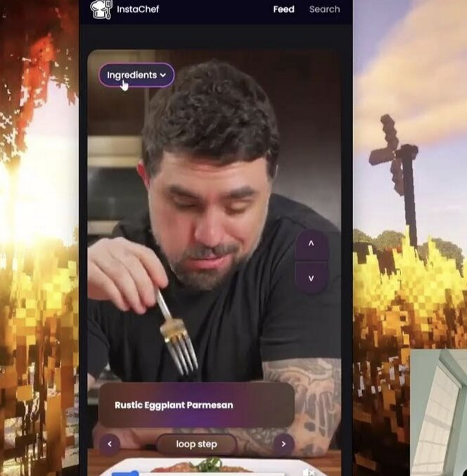

# InstaChef

## Inspiration
We've found that online recipe resources have significant flaws. Traditional recipe websites are overly long, packed with ads, and often pushing content you don’t need. On the other hand, short-form recipe videos, while concise, are too brief to follow along with easily. The core issue is that instructional content is being forced onto platforms designed for quick entertainment rather than step-by-step guidance. Frustrated by the lack of a smooth, hassle-free way to find and follow recipes, my team was inspired to create a better solution.

## What it does
InstaChef takes short-form recipes and transforms them into an instructional format. You can search for any recipe you'd like to make, or browse our feed, and view the recipes in a way that's easy to follow. Our site generates an ingredients list, as well as step-by-step instructions for the video. You can watch the video through, or jump forward or back to a particular step. The instructional step is displayed as it's being shown to you in the video, and you can pause on a step, or have it repeat itself in a loop. These features make our site an intuitive and efficient tool for anyone looking to cook with ease and confidence.

## How we built it
InstaChef is built entirely in vanilla JavaScript, HTML, and CSS. We have two different .html and .js file pairs, for our Search and Feed pages. Our site makes use of several APIs in order to function:
- YouTube Search and Thumbnails - Google Cloud Console (console.cloud.google.com)
- YouTube Captions - Search API (searchapi.io)
- Generate Ingredients and Instructions - OpenAI's gpt-4o (https://platform.openai.com/docs/overview)
- YouTube MP4 Downloader - ZylaLabs (zylalabs.com) 
The functions of the site are coded in JavaScript, and the UI in CSS.

## Challenges we ran into
Some major challenges we ran into were the limitations of the APIs we used. Many of them cap the number of requests you can make, or make you pay a fee for each one. This made it more difficult to debug, as we could not test all of our functionality without running into these request limits. Furthermore, our team ran into issues with time management, where we spent too long trying to perfect a detail in the UI, rather than making progress on the site's functionality. This made it particularly stressful as we neared the deadline, and severely impeded our sleep.

## Accomplishments that we're proud of
We are proud that our team was able to make product that is functional right off the bat. We don't require any server or user-uploads; I could send my mom the repository right now and she could follow a recipe. Another accomplishment is that this site meaningfully improves the current landscape of online recipes. It offers a unique balance of accessibility and conciseness.

## What we learned
Throughout the development of this project, we became significantly more comfortable handling JavaScript syntax and APIs that don't have perfect documentation. We also learned more about the process of developing a cohesive and aesthetic user interface.

## What's next for InstaChef
Right now our feed is sourced from local files in the repository, and therefore very limited. To improve our site, we could create an algorithm to retrieve videos similar to the algorithms of social media feeds. Eventually, we can form partnerships with cooking content creators, and have them upload their content directly to our site. This would allow us to move away from some of our APIs that the site is currently dependent on.

## How to set up:
You need API keys from the following APIs for the search feature:
  Google Cloud Console (enable YouTube Data API)
  Search API
  OpenAI
  ZylaLabs
